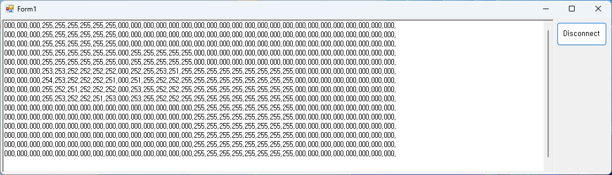

## Klib2-csharp
API code used in Snowforce3 and ForceLAB2

## Development environment
* Visual Studio 2017  
    Language: C#
    Freamwork: .Net Framework 4.6.1
* Snowforce 3
   * https://github.com/kitronyx/SnapshotAnalyzer

## QUICK START
* Download or clone source code  
* Open klib2_test.sln  

